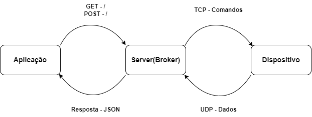

# PBL01---Redes---Internet-das-Coisas
Problema 1 da matéria TEC502 - Concorrência e Conectividade

### Sumário 
+ [Como Executar](#como-executar-a-solução)
+ [Introdução](#introdução)
+ [Produto Desenvolvido](#produto-desenvolvido)
+ [Arquitetura da Solução](#arquitetura-da-solução)
+ [Protocolo de Comunicação](#protocolo-de-comunicação)
+ [API Restful](#api-restful)
+ [Conexões e Dados](#conexoes-e-dados)
+ [Gerenciamento do Dispositivo](#gerenciamento-do-dispositivo)
+ [Desempenho e Confiabilidade](#desempenho-e-confiabilidade)

## Como Executar:

A solução para o problema, assim como requerida, está dividida em três sistemas, os quais estão disponilibizados no formate de imagens Docker. Assim, para que seja feito o uso da solução é necessário possuir o Docker instalado na máquina e executar os seguintes comandos:

### Servidor(Broker)
Execute o seguinte comando para obter a imagem do servidor:
```bash
docker pull yxngnd/server:latest
```
Execute a imagem:
```bash
docker run -it --network=host yxngnd/server
```

### Dispositivo
Execute o seguinte comando para obter a imagem do server:
```bash
docker pull yxngnd/device:latest
```
Execute a imagem e substitua o campo *server_ip* pelo ip do server:
```bash
docker run -it --network=host -e HOST={server_ip} yxngnd/device
```

### Aplicação
Execute o seguinte comando para obter a imagem do server:
```bash
docker pull yxngnd/client:latest
```
Execute a imagem e substitua o campo *server_ip* pelo ip do server:
```bash
docker run -it --network=host -e HOST={server_ip} yxngnd/client
```

## Introdução

A evolução tenoclogica tem se tornado cada vez mais evidente, permitindo que um maior número de pessoas esteja conectada a rede nas mais diversas partes do planeta, com isso, cresceu também a busca por tornar mais conectados os objetos e dispositivos do dia a dia. A Internet das Coisas (IoT) foi concebida por Kevin Ashton, um pesquisador britânico, como um sistema de sensores ubíquos e um padrão global para RFID. Isso permitiu a identificação de objetos e a conexão de informações do mundo físico à Internet. Tendo isso em mente, foi requisitado o desenvolvimento de um produto que agisse como um *middleware* entre os dispositivos IoT e uma aplicação.

Esse *middleware* solicitado deveria ser um *broker* que permitiisse a troca de mensagens entre os dispositivos e a aplicação, através dele a aplicação deveria mandar comandos para interagir com suas funcionalidades, e também, deveria gerenciar os dados enviados por um ou mais dispositivos conectados para a aplicação.

A solução consiste em três partes: um dispositivo simulado, possuindo uma interface que permita alterar seus dados, uma aplicação que consuma uma API Restful desenvolvida e um *broker* que faz a mediação dos dois primeiros.

O sistema foi desenvolvido por completo utilizando a linguagem de programação C++, fazendo uso da biblioteca Beast do conjunto de bibliotecas Boost para desenvolver a API e fazer a comunicação entre a aplicação e o *broker*.

## Produto Desenvolvido

A solução é dividida em três partes: aplicação, broker e dispositivo, ilustrados na Figura 1.

- **Figura 1:** *Diagrama da solução do problema.*

### Aplicação
A aplicação é uma interface acessada por meio da linha de comando (CLI), usada para gerenciar, tanto receber e exibir os dados dos dispositivos, quanto enviar comandos de alteração dos atributos do dispositivo. A aplicação faz requisições *HTTP* para a API do servidor.

### Server
O servidor é onde está contido a parte principal do produto, se comunica com a aplicação lidando com as requisições feitas e com o dispositivo através de comunicação TCP, para enviar comando ao dispositivo, e UDP para receber os dados do dispositivo em formato JSON e armazená-los num buffer para que os dados de todos os dispositivos conectados ao servidor sejam enviados à aplicação quando ela faz uma requisição.

### Dispositivo
O dispositivo funciona como um simulador de uma lâmpada inteligente, possuindo os atributos de ligado/desligado, intensidade da luz e um número de identificação, que é único e não pode ser alterado. O dispositivo se comunica com o broker, recebendo comandos através de comunicação TCP, tratando os comandos recebidos e alterando seus atributos, além disso, está a todo momento enviando seus dados ao broker via comunicação UDP.

## Arquitetura da Solução

Para que houvesse um bom funcionamento do sistema, a comunicação e a troca de mensagen entre aplicação e servidor, também servidor e dispositivo, a comunicação foi organizada da seguinte forma:

**Inicialização:** O servidor é o primeiro a ser inicializado, pois é necessário que um ip seja associado ao servidor, esse ip será utilizado para inicializar o dispositivo e a aplicação, garantindo que a parte *broker* esteja funcionando. Ao mesmo tempo, o servidor estará rodando a função que lida com as requisições *HTTP*.

**Comunicação com dispositivos:** Após a inicialização, o servidor fica escutando as portas TCP e UDP, na comunicação TCP, o servidor escutará até que uma conexão seja aceita e estabelecida, o servidor então verificará se a conexão já existe e caso não exista, guardará a conexão junto com um id gerado numa lista de conexões, esse id gerado é enviado e designado ao dispositivo via TCP para que o cadastro seja completo. Já na comunicação UDP, o servidor fica o tempo todo recebendo dados dos dispositivos conectados, após receber os dados, ele verifica se o id do dispositivo ja existe, caso não exista adiciona a lista e caso exista o substitui.

**Lidando com requisições HTTP:** O servidor fica o tempo todo esperando por requisições, ao receber uma requisição, o servidor primeiro lida com ela, identificando o tipo de requisição e repassando-a para o método correspondente. Ao receber uma requisição *GET* o servidor envia como resposta uma lista de dispositivos contendo todos os dispositivos conectados. E ao receber uma requisição *POST*, o servidor trata o comando recebido e o envia ao dispositivo correspondente, enviando como resposta uma mensagem de confirmação. Ambos possuem tratamento para caso algo impeça a requisição se ser bem sucedida.

## Protocolo de Comunicação

Para que houvesse uma comunicação entre dispositivos e servidor(broker) foram utilizados em nível de transporte os protocolos Transmission Control Protocol(TCP) e User Datagram Protocol(UDP) e em nível de aplicação foi utilizado o Hypertext Transfer Protocol(HTTP). 

O protocolo TCP permite uma troca de dados confiável entre as partes conectadas, pois exige que haja uma conexão entre elas. O protocolo UDP não tem essa preocupação e permite que os dados sem enviados para o destino sem se preocupar se os dados realmente chegarão.

O protocolo HTTP define os padrões para troca de dados entre programas de aplicação, essenciais para comunicação feita entre aplicaçãos em diferentes dispositivos.

| Protocolo     | Envio         | Resposta      |Partes envolvidas|
| ------------- | ------------- | ------------- | ------------- | 
| HTTP - GET    |      "/"      | {"devices:"[{id, on, intensity, color}...]}           |  Aplicação -> Broker  |
| HTTP- POST    |"/" - {id, comand, value}      | {Sucesso/Falha}           |     Aplicação -> Broker     |
| UDP           | {id, on, intensity, color}  | -           | Dispositivo -> Broker|
| TCP           | {command, value}  | -           | Broker -> Dispositivo|

A tabela expõe os protocolos utilizados e quem os utiliza. O protocolo HTTP é utilizado para fazer requisições ao *broker*


## API Restful
A tabela abaixo mostra as rotas da aplicação, o método e para que elas são utilizadas.

| Rota          | Método        | Descrição     |
| ------------- | ------------- | ------------- |
| "/"           |      GET      | Recebe como resposta os dispositivos conectados ao broker              |
| "/"           |      POST     | Envia ao broker um comando para alterar um atributo do dispositivo              |

## Conexões simultâneas e Dados


### Threads
Threads são utilizadas para tornar sistemas mais eficientes ao permitir que várias tarefas sejam executadas simultaneamente em um programa.

No dispositivo existem três *threads*, uma para enviar dados em UDP, outra para receber comandos via TCP e a última para que a interface de gerenciamento do dispositivo. Se fez necessário o uso de *threads* pois era preciso que o programa continuasse recebendo comandos via TCP enquanto o menu de gerenciamento estivesse ativo, além de, por decisão de projeto, o dispositivo deve enviar a todo momento deus dados para o broker, ao invés de enviar somente quando editado.

O servidor também possui três *threads*, a primeira para que o broker fique a todo momento tentando estabelecer conexões com novos dispositivos via TCP, enquando a segunda recebe dados via UDP, e por último, mantenha ativo a parte que recebe e lida com as requisições HTTP.

A aplicação possui duas threads, uma para manter o menu de gerenciamento dos dispositivos conectados e outra para ficar a todo momento solicitando a lista de dispositivos cadastrados.

### Dados
Toda a comunicação é baseada no uso de JSON, uma estrutura textual que permite enviar mais de uma informação no mesmo dado, os dados enviados por requisições HTTP e os enviados ao dispositivo via TCP possuem estrutura semelhante, permitindo que o mesmo dado seja apenas repassado sem necessidade de modificação, também, os dados que chegam do dispositivo podem ser enviados diretamente à aplicação, pois são feitos num formato que permite que o tratamento para exibição seja feita na aplicação.

## Gerenciamento do Dispositivo
O gerenciamento do dispositivo foi feito de forma que os dados podem ser alterados em ambas as interfaces, possuindo comandos de alteração de cada um dos dados, com exceção do id que é único e só é alterado no seu cadastro no broker, os dados alterados na interface do dispositivo são atualizados no broker, enviados e exibidos na aplicação e os dados alterados na aplicação são enviados para o broker e repassados ao dispositivo que por sua vez envia atualizado ao broker. 

## Desempenho e Confiabilidade

### Formas de melhorar o desempenho
Para melhora do desempenho, a solução possui uma lista de uma estrutura chamada `Connection`, que armazena o id e a conexão TCP do dispositivo, permitindo haja uma busca rápida pelos dispositivos já cadastrados. Outra estrutura importante é a lista de dispositivos, que funciona como uma cache, fazendo com que ao receber uma requisição, o broker não precise pedir os dados do dispositivo, eles já estão registrados nessa cache. Os comandos também são armazenados numa espécie de cache única, que armazena um único comando, que é recebido, tratado, enviado e limpo.

### Tratamento de conexões

Em todos os processos das conexões feitas existem tratamentos que impedem que ocorram erros indesejados, onde, quando não é possível que uma parte do processo de conexão seja feito, o broker continua tentando e verificando se a conexão foi bem sucedida, isso possibilita que conexões sejam reestabelecidas após serem perdidas.

